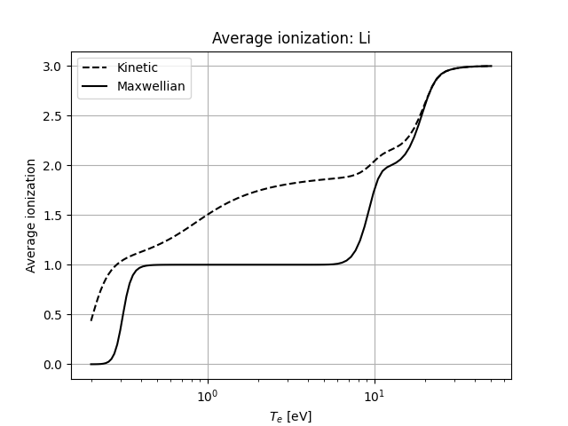

# SIKE

SIKE (**S**crape-off layer **I**mpurities with **K**inetic **E**lectrons) solves the density evolution equations for a given set of impurity atomic states amongst a fixed background plasma. The provided atomic data is generated using [FAC](https://github.com/flexible-atomic-code/fac), but data from any source can be used provided it is formatted correctly (this format is described below). Atomic states are resolved in n, l and (optionally) j.

d.power19@imperial.ac.uk

## Dependencies
SIKE is written in python 3 and does not require building. The following modules are used, which can be installed with a package manager such as pip or conda:
- numpy
- scipy
- numba
- matplotlib
- mpi4py
- petsc4py

For petsc4py, you can either install using your package manager or build alongside a [local petsc installation](https://petsc.org/release/install/). To do this:
1. Install cython python package
2. Configure petsc with `--with-petsc4py=1`
3. Build petsc
4. Add `$PETSC_DIR/$PETSC_ARCH/lib` to `PYTHONPATH` environment variable

## Getting started
There are two ways of initialising SIKE:
1. With temperature and density profiles, assuming Maxwellian electrons.
2. With electron distribution functions and a velocity grid. 

The second method is required to model non-LTE plasmas. 

If you do not want to work in the same directory as the SIKE source files, you can add 
```python
import sys
sys.path.insert(1, 'path/to/SIKE/')
```
...to any python scripts which use SIKE. 

### 1. Initialise from temperature and density profiles

```python
import numpy as np
import SIKE

temp = np.linspace(1,10,50) # Temperature profile in eV
dens = 1e19 * np.ones(50)   # Density profile in m^-3
elements = ['Li']

r = SIKE.SIKERun(Te=temp, ne=dens, opts={"modelled_impurities": elements})
```

### 2. Initialise from electron distribution functions

SIKE expects the isotropic part of an electron velocity distibution function in units of $m^{-6} s^{-3}$. The format should be a 2D numpy array indexed by velocity, then spatial location. As an example we generate a series of bi-Maxwellian distributions, $f(v) = f_{Max}^{cold} + f_{Max}^{hot}$ with a Maxwellian distribution at $T$ and $n$ given by $f_{Max}(v) = n (\frac{m_e}{2 \pi k T})^{3/2} e^{-m_ev^2/kT}$.

```python
import numpy as np
import SIKE
import SIKE_tools

num_x = 100
T_hot = 100 * np.ones(num_x)        # Constant hot tail profile (eV)
T_bulk = np.geomspace(0.1,50,num_x) # Bulk temperature profile (eV)
n_tot = 1e19 * np.ones(num_x)       # Constant total density profile (m^-3)
hot_frac = 0.001                    # Hot tail is 0.1% of total density

vgrid = SIKE_tools.default_vgrid
fe = SIKE_tools.get_bimaxwellians(hot_frac * n_tot, (1 - hot_frac) * n_tot, T_hot, T_bulk, vgrid, normalised=False)

elements = ['Li']

r = SIKE.SIKERun(fe=fe, vgrid=vgrid, opts={"modelled_impurities": elements,
                                           "kinetic_electrons": True,
                                           "maxwellian_electrons": True})
```

### Compute densities and investigate results

Now simply run 
```python
r.run()
```
The rate matrix will be constructed and the state densities will be evolved until equilbrium is reached. 

The equilibrium densities are stored in `r.dens_Max` and `r.dens`, for densities obtained with Maxwellian and non-Maxwellian background electrons respectively. The module `SIKE_plotting` provides a number of functions to plot the results. For example, to plot the average ionization of the bi-Maxwellian example above:

```python
from SIKE_plotting import *

plot_Zavg(r,'Li',logx=True)
```



## Options
...

## Numerics 
...

## Running in parallel

SIKE uses mpi4py to support parallel execution. Parallelisation is performed in the x-direction. To use this feature, simply run a script which calls SIKE with mpirun or mpiexec.
```
mpirun -n 4 python3 sike_script.py
``` 
SIKE will determine the local spatial region for each processor and solve the corresponding matrix equation.

## Atomic data format

Two json files are expected for a given element to be modelled:
1. SYMBOL_levels_nl[j].json
2. SYMBOL_transitions_nl[j].json

where SYMBOL is the chemical symbol of the impurity species and "j" specifies whether atomic levels are nl-resolved or j-resolved. For example, j-resolved data for lithium would be contained in files called "Li_levels_nlj.json" and "Li_transitions_nl.json" in the atom_data/Lithium local directory.

### Levels file
The levels json file is expected to contain a list of dictionaries which describe each atomic level being modelled. Below is an annotated example showing expected fields in a j-resolved levels file for carbon (the level shown is that of the ground state). Note that comments with # do not work in json so would need removing. 
```
[
    {
        "id": 0,                # A unique ID for the level
        "element": "C",         # Chemical symbol of the element to which this level belongs
        "nuc_chg": 6,           # Nuclear charge of the element
        "num_el": 6,            # Number of electrons in this level
        "config": "2p2",        # Electronic configuration of valence electrons
        "energy": -1025.00152,  # Energy of this level (in eV) relative to some highest-energy state (for the FAC data provided this is the bare nucleus)
        "n": 2,                 # Principal quantum number of the level
        "l": 1,                 # Orbital angular momentum quantum number
        "j": 3.5,               # Total angular momentum quantum number (only expected in j-resolved levels file)
        "stat_weight": 8        # (2j + 1)/statistical weight of the level
    },
    # All other levels go here
    ... 
]
```

### Transitions file
The transitions json file contains all transitions between atomic levels which are to be modelled. Below is an annotated example showing the expected fields. Note that comments with # do not work in json so would need removing. 

```
    {
        "E_grid": [
            # The energy grid (in eV) on which collisional cross-sections are evaluated
            ...
        ]
    },
    {
        "type": "ionization",   # The transition type
        "element": "C",         # The element to which this transition belongs
        "from_id": 1427,        # The unique ID of the initial state
        "to_id": 1478,          # The unique ID of the final state
        "delta_E": 7.6545,      # The difference in energy (in eV) between initial and final states
        "sigma": [
            # The cross-section (in cm^2) for the given collisional process, evaluated at each point on "E_grid"
            ...
        ]
    },
    {
        "type": "emission",     # Example of an emission transition (i.e. spontaneous deexcitation)
        "element": "C",
        "from_id": 551,
        "to_id": 543,
        "delta_E": 367.477326,
        "rate": 148.0718        # Emission rate (in s^-1)
    },
    # All other transitions go here
    ...
```
Possible transition types are "ionization", "excitation", "radiative recombination", "emission" and "autoionization". Of these, ionization, excitation and radiative recombination should include a "sigma" field, while autoionization and emission should include a "rate" field. 

For ionization and excitation, SIKE will automatically handle the inverse processes of three-body recombination and collisional de-excitation. 
